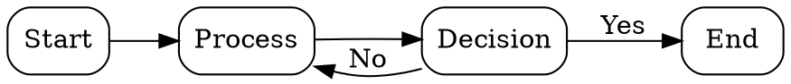
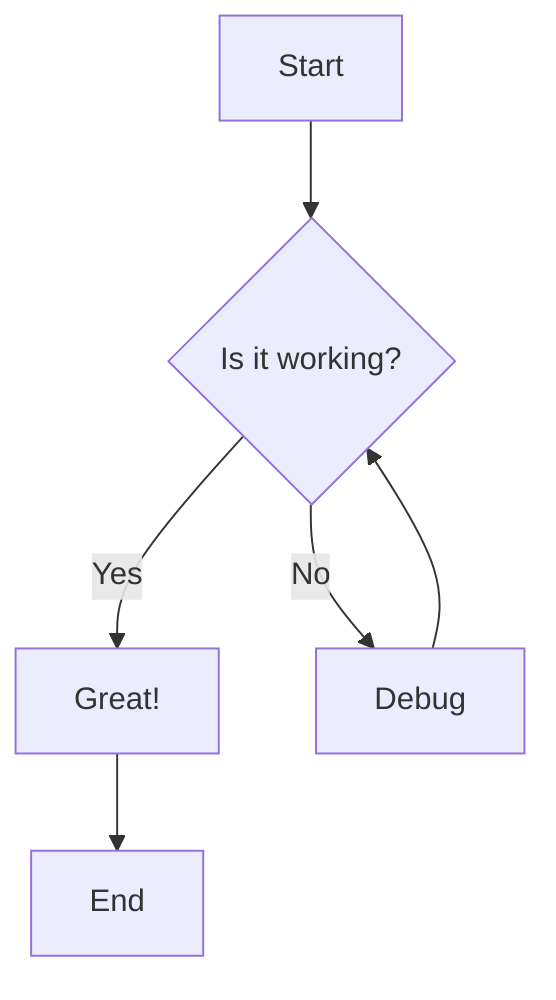

# Graphviz & Mermaid Viewer

A modern web-based viewer for **Graphviz** and **Mermaid** diagrams, built with React, TypeScript, and Vite.

## Features

- 📊 **Dual Rendering Engines**: Support for both Graphviz DOT and Mermaid diagram syntax
- 🎨 **Modern UI**: Clean interface built with Shadcn UI and Tailwind CSS
- ✏️ **Monaco Editor**: Professional code editor with syntax highlighting
- 🔄 **Real-time Preview**: Instant visualization as you type
- 💾 **Auto-save**: Automatic localStorage persistence
- 📥 **Export**: Download diagrams as SVG files
- 📋 **Copy to Clipboard**: Quick code copying functionality
- 🎯 **Sample Templates**: Pre-loaded examples to get started quickly
- 🌓 **Dark Mode Ready**: Supports dark mode theming
- 📱 **Responsive Design**: Works on desktop and mobile devices

## Tech Stack

- **Frontend**: React 19 + TypeScript
- **Build Tool**: Vite
- **UI Framework**: Tailwind CSS + Shadcn UI
- **Editor**: Monaco Editor
- **Graphviz Rendering**: @hpcc-js/wasm
- **Mermaid Rendering**: mermaid
- **Icons**: lucide-react

## Getting Started

### Prerequisites

- Node.js 18+ and npm

### Installation

1. Clone the repository:
```bash
git clone <repository-url>
cd graphviwer
```

2. Install dependencies:
```bash
npm install
```

3. Start the development server:
```bash
npm run dev
```

4. Open your browser and navigate to `http://localhost:5173`

## Usage

### Graphviz Tab
Write your DOT language code in the editor to create:
- Flowcharts
- State diagrams
- UML diagrams
- Network topologies
- And more...

Example:


### Mermaid Tab
Create diagrams using Mermaid syntax:
- Flowcharts
- Sequence diagrams
- Gantt charts
- Class diagrams
- And more...

Example:


### Toolbar Functions
- **Sample**: Insert a sample diagram
- **Clear**: Clear the editor
- **Copy Code**: Copy current code to clipboard
- **Download SVG**: Export diagram as SVG file

## Building for Production

Build the project:
```bash
npm run build
```

Preview the production build:
```bash
npm run preview
```

## Deployment

### Automatic Deployment (GitHub Actions)

This project includes a GitHub Actions workflow that automatically builds and deploys to GitHub Pages.

**Setup:**
1. Go to your repository Settings → Pages
2. Under "Source", select **GitHub Actions**
3. Push to `main` or your feature branch to trigger automatic deployment

The workflow runs on:
- Push to `main` branch
- Push to `claude/new-feature-implementation-011CV3mqT9kYCto1DVs3oZHX` branch
- Manual trigger from Actions tab

**Your site will be available at:**
`https://<username>.github.io/graphviwer/`

### Manual Deployment

Alternatively, deploy manually using npm:
```bash
npm run deploy
```

This will build the project and publish to the `gh-pages` branch.

## Project Structure

```
graphviwer/
├── src/
│   ├── components/
│   │   ├── ui/          # Shadcn UI components
│   │   ├── Editor.tsx   # Code editor component
│   │   ├── Preview.tsx  # Diagram preview component
│   │   └── Toolbar.tsx  # Toolbar component
│   ├── lib/
│   │   ├── graphvizRenderer.ts  # Graphviz rendering logic
│   │   ├── mermaidRenderer.ts   # Mermaid rendering logic
│   │   └── utils.ts             # Utility functions
│   ├── App.tsx          # Main application component
│   ├── main.tsx         # Application entry point
│   └── index.css        # Global styles
├── public/              # Static assets
├── package.json
└── vite.config.ts       # Vite configuration
```

## Security

This application implements several security measures to protect against XSS attacks:

- **SVG Sanitization**: All rendered SVGs are sanitized using DOMPurify
- **Content Security Policy**: CSP meta tag configured to restrict resource loading
- **localStorage only**: All data stays on your device, nothing is sent to servers

⚠️ **Security Notice**: Only render diagrams from trusted sources. While we sanitize output, always be cautious with code from unknown sources.

## License

This project is open source and available under the MIT License.

## Contributing

Contributions are welcome! Please feel free to submit a Pull Request.

## Acknowledgments

- [Graphviz](https://graphviz.org/) - Graph visualization software
- [Mermaid](https://mermaid.js.org/) - Diagram and flowchart generation
- [Shadcn UI](https://ui.shadcn.com/) - Re-usable components
- [Monaco Editor](https://microsoft.github.io/monaco-editor/) - Code editor
